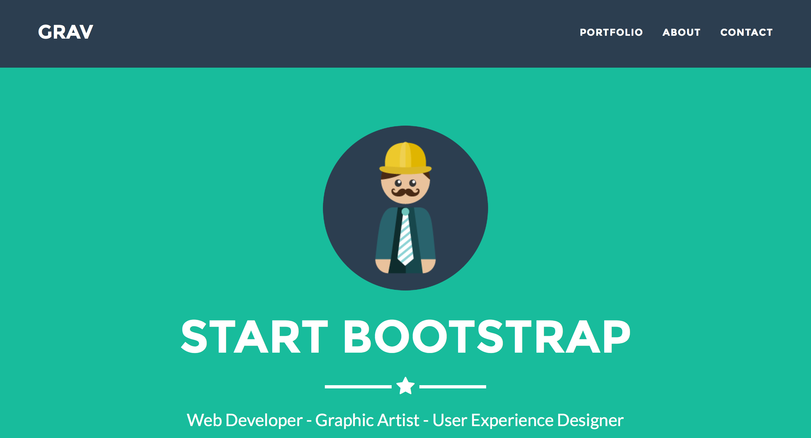

# Freelancer Theme for Grav

This Grav theme is based on the [Jekyll Agency theme](https://github.com/jeromelachaud/freelancer-theme) by [Jerome Lachaud (jeromelachaud)](https://github.com/jeromelachaud), which originated from the [Freelancer Bootstrap theme by Start Bootstrap](http://startbootstrap.com/templates/freelancer/).

# Demo

Demo of this theme can be found here: http://demo.gibstudio.com/grav-freelancer

Fully loaded Grav skeleton with all necessary plugins and content commited here: https://github.com/yaroslav-v/grav-skeleton-freelancer-site

# Features

* Flat icons by flaticons.com
* LESS files and compiled CSS included
* Fixed top navigation that collapses on scroll
* Scrollspy on navigation items
* Perfectly responsive portfolio grid with hover effects
* Responsive, full screen modal windows for featuring project details
* Custom horizontal rules using Font Awesome icons
* Custom outline button style
* Mobile friendly contact form with floating form labels
* Includes jqBootstrapValidation plugin for contact form validation

# Installation

Installing the Twenty theme can be done in one of two ways. Our GPM (Grav Package Manager) installation method enables you to quickly and easily install the theme with a simple terminal command, while the manual method enables you to do so via a zip file.

## GPM Installation (Preferred)

Unsupported now.

## Manual Installation

To install this theme, just download the zip version of this repository and unzip it under `/your/site/grav/user/themes`. Then, rename the folder to `freelancer`. You can find these files either on [GitHub](https://github.com/yaroslav-v/grav-theme-freelancer).

You should now have all the theme files under

    /your/site/grav/user/themes/freelancer

>> NOTE: This theme is a modular component for Grav which requires the [Grav](http://github.com/getgrav/grav), [Error](https://github.com/getgrav/grav-theme-error) and [Problems](https://github.com/getgrav/grav-plugin-problems) plugins.

# Setup

If you want to set Freelancer as the default theme, you can do so by following these steps:

* Navigate to `/your/site/grav/user/config`.
* Open the **system.yaml** file.
* Change the `theme:` setting to `theme: freelancer`.
* Save your changes.
* Clear the Grav cache. The simplest way to do this is by going to the root Grav directory in Terminal and typing `bin/grav clear-cache`.

Once this is done, you should be able to see the new theme on the frontend. Keep in mind any customizations made to the previous theme will not be reflected as all of the theme and templating information is now being pulled from the **twenty** folder.

# Updating

As development for the Twenty theme continues, new versions may become available that add additional features and functionality, improve compatibility with newer Grav releases, and generally provide a better user experience. Updating Twenty is easy, and can be done through Grav's GPM system, as well as manually.

## GPM Update (Preferred)

Unsupported now.

## Manual Update

Manually updating Twenty is pretty simple. Here is what you will need to do to get this done:

* Delete the `your/site/user/themes/twenty` directory.
* Download the new version of the Twenty theme from either [GitHub](https://github.com/getgrav/grav-theme-twenty) or [GetGrav.org](http://getgrav.org/downloads/themes).
* Unzip the zip file in `your/site/user/themes` and rename the resulting folder to `twenty`.
* Clear the Grav cache. The simplest way to do this is by going to the root Grav directory in terminal and typing `bin/grav clear-cache`.

> Note: Any changes you have made to any of the files listed under this directory will also be removed and replaced by the new set. Any files located elsewhere (for example a YAML settings file placed in `user/config/themes`) will remain intact.
